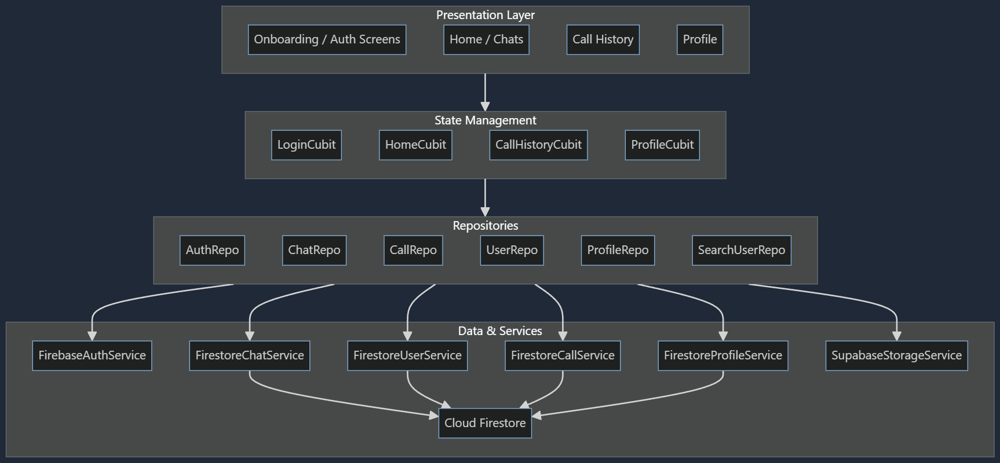

# ChatBox

ChatBox is a cross-platform Flutter chat application that provides real-time messaging, call history, and modern authentication on top of Firebase services. It follows a feature-first architecture with BLoC/Cubit for state management and a repository layer over Firestore and other backend services.

---

## 1. Project Overview

ChatBox is built as a scalable messaging experience where users can sign up, log in, recover passwords, search for other users by email, and exchange rich chat messages (text, media, voice). It also includes call history tracking and a profile area with editable settings and avatars.

---

## 2. Tech Stack

**Framework**

* Flutter (multi-platform app: mobile & desktop)

**Navigation & UI**

* `go_router` for declarative navigation and deep-link friendly routes
* `flutter_screenutil` for responsive sizing and layout

**State Management & DI**

* `flutter_bloc` / `bloc` for Cubit/BLoC state management (e.g., `LoginCubit`, `HomeCubit`, `CallHistoryCubit`, `ProfileCubit`)
* `get_it` as a service locator (used in `setupGetIt`)

**Backend & Data**

* `firebase_core`, `firebase_auth`, `cloud_firestore` for authentication and real-time data
* `supabase_flutter` as a storage backend implementation for profile images and other media
* `dartz` for functional `Either` and error handling in repositories

**Media & Platform**

* `image_picker` for profile image and avatar selection
* Various platform-specific plugins for audio, file selection, and secure storage

---

## 3. Architecture

The app follows a feature-first, layered architecture:

* **Presentation layer**: Flutter screens and widgets in `features/*/presentation`, driven by Cubits like `LoginCubit`, `HomeCubit`, `CallHistoryCubit`, and `ProfileCubit`.
* **Domain / Data access layer**: Repositories (`AuthRepo`, `ChatRepo`, `CallRepo`, `UserRepo`, `ProfileRepo`, `SearchUserRepo`) define contracts and delegate to service classes to access Firestore, Firebase Auth, and storage, returning `Either<Failure, T>`.
* **Core services**: Firestore services (`FirestoreChatService`, `FirestoreUserService`, `FirestoreCallService`, `FirestoreProfileService`) encapsulate low-level operations.
* **Storage**: `SupabaseStorageService` implements `StorageService` and handles file uploads (avatars, attachments).
* **Routing & Composition**: `AppRouter` defines GoRoutes and wires Cubits and repos via `BlocProvider`/`MultiBlocProvider`.

### Architecture Diagram



---

## 4. Features

**Authentication & Onboarding**

* Email/password signup and login with validation mixins and custom form components.
* Social login entry points (Google and Facebook) via `FirebaseAuthService`.
* Password recovery flow with reset email, validation, and success/error dialogs.

**User Profiles**

* Profile details, picture, and settings managed through `ProfileCubit` and `ProfileState`.
* Profile picture selection using camera/gallery and upload via `ProfileImageService`.
* Profile editing dialogs for name, email, phone, about, privacy, and account actions.

**Real-Time Chat**

* `MessageModel` supports statuses (pending, sent, delivered, read, failed) and multiple types (text, voice, image, file).
* Firestore-backed one-to-one chat rooms with unread counts and server timestamps.
* Chat cubit handles sending text, voice messages, attachments with optimistic updates.

**Home & Search**

* Home chat list driven by `HomeCubit`, with batched user profile fetching via `UserRepo`.
* Search users by email with `SearchUserCubit`.

**Calls & History**

* `CallModel` represents calls with types, status and timestamps.
* `FirestoreCallService` manages call creation, updates, streams and cleanup.

**Navigation**

* Centralized `AppRouter` wires all screens (splash, onboarding, login, signup, choose picture, recover password, home, chat, calls, profile, navigation bar) and injects dependencies using `getIt`.

---

## 5. Testing

Repository includes standard Flutter test scaffolding. Suggested targets:

* Cubit/BLoC unit tests (`LoginCubit`, `HomeCubit`, etc.)
* Widget tests for core views (login, onboarding, home, chat list, call history, profile)

Add tests under `/test` using `flutter_test` and BLoC testing patterns.

---

## 6. Folder Structure

```
lib/
  core/
    cubit/
    errors/
    helpers/
    repos/
    service/
    utils/
    widgets/
  features/
    auth/
      data/
      presentation/
    onboarding/
      presentation/
    home/
      data/
      presentation/
    chat/
      data/
      presentation/
    calling/
      data/
      presentation/
    profile/
      data/
      presentation/
    navigation_bar/
      presentation/
    splash/
      presentation/
  main.dart

android/ ios/ macos/ linux/ windows/ web/
```

---

## 7. How to Run the Project

### Prerequisites

* Install Flutter (stable channel compatible with the project).
* Install IDE (Android Studio or VS Code) with Flutter & Dart plugins.
* Create a Firebase project (Firestore + Authentication).

### Clone & Setup

```bash
git clone https://github.com/EsAm1973/ChatBox-App.git
cd ChatBox-App
flutter pub get
```

### Configure Firebase

* Enable Email/password authentication and Cloud Firestore.
* Add platform configuration files:

  * Android: `android/app/google-services.json`
  * iOS: `ios/Runner/GoogleService-Info.plist`
  * Web/Desktop: configure `DefaultFirebaseOptions` in `firebase_options.dart`.
* Ensure bundle IDs/application IDs match Firebase config.

### Run

```bash
flutter run
# or target a specific device
flutter run -d chrome
```

---

## 8. Future Improvements

* Add comprehensive unit and widget tests.
* Message reactions, typing indicators, read receipts and message editing.
* Support group chats and broadcast channels.
* Integrate in-app voice/video calling SDK.
* Add push notifications and background call handling.
* Localization and RTL language support.
* Harden validation and abuse protection; improve offline caching.

---

## 9. Screenshots

Place screenshots in `screenshots/` and update filenames as needed.

| Onboarding                   | Home / Chats           | Chat Detail            |
| ---------------------------- | ---------------------- | ---------------------- |
| `screenshots/onboarding.png` | `screenshots/home.png` | `screenshots/chat.png` |

| Call History            | Profile                   |
| ----------------------- | ------------------------- |
| `screenshots/calls.png` | `screenshots/profile.png` |

---

## 10. Social Links

* LinkedIn: [(Mohamed Esam)](https://www.linkedin.com/in/mohamed-esam-4085b524a/)

Contributions, issues, and feature requests are welcome—open a discussion or pull request.
